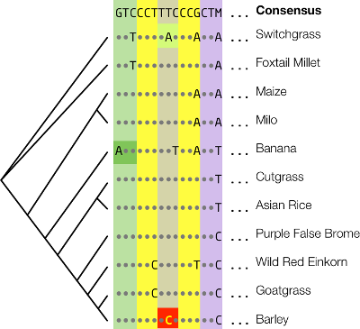

# Table of Contents
- [Overview](#overview)
- [Citation](#citation)
- [Downloading](#downloading)
    - [Dependencies](#dependencies)
- [UMN MSI Instructions](#msi)
- [Input Files](#inputs)
- [Output Files](#outputs)
    - [HyPhy Report Format](#hyphyreport)
    - [Making Deleterious Predictions](#predictions)
    - [Inferring Ancestral States](#ancestral)
- [Usage](#usage)
    - [Basic Invocation](#basic)
    - [Subcommands](#subcommands)
        - [General Options](#general)
        - [Setup Subcommand](#setup)
        - [Fetch Subcommand](#fetch)
        - [Align Subcommand](#align)
        - [Predict Subcommand](#predict)
        - [Compile Subcommand](#compile)
    - [Example Command Lines](#examples)
- [Configuration File Format](#config)
- [Runtimes](#runtime)
- [Methods](#methods)
- [Data Sources](#databases)

# Overview
`BAD_Mutations` (**B**LAST-**A**ligned-**D**eleterious?) performs a likelihood ratio test (LRT) for the prediction of deleterious variants. The package is comprised of Python and Bourne Again Shell (BASH) scripts. The LRT uses a [HyPhy](http://hyphy.org/w/index.php/Main_Page) script. `BAD_Mutations` was written with Python 2 syntax, but conversion to Python 3 is planned. `BAD_Mutations` is designed to be run from the command line. Running from an interactive Python environment is not recommended nor supported.

`BAD_Mutations` contains five major subcommands: `setup`, `fetch`, `align`, `predict`, and `compile`. Both `setup` and `fetch` are meant to be run once, or very rarely. The `align` subcommand generates phylogenetic trees and multiple sequence alignments for input to the prediction scripts. The `predict` subcommand does the actual variant effect prediction. More information about how to run `BAD_Mutations` is available in the “Usage” section.

Briefly, `BAD_Mutations` predicts deleterious variants using a sequence constraint approach. For a given query gene sequence and list of nonsynonmyous SNPs, a multiple sequence alignment among homologues is produced, and the given codons are tested for conservation. Variants that alter a codon with a high degree of conservation are inferred to be deleterious. More details on the procedure in `BAD_Mutations` is available in the “Methods” section.

An alignment of phytochrome C (PhyC) used for prediction of a nonsynonymous SNP in barley is shown below.

The phylogenetic relationships of the gene sequences are shown on the left. The consensus sequence is shown at the top. Dots correspond to identity to consensus, and letters show mismatches. Colored boxes behind codon triplets correspond to amino acid residues. The query polymorphism is shown in yellow. The codon is conserved, so the SNP is inferred to be deleterious. This polymorphism is causative for early maturity in barley ([Nishida *et al.* (2013)](http://www.plantphysiol.org/content/early/2013/09/06/pp.113.222570.abstract)).

Examples of alignment columns that produce deleterious and 'tolerated' nonsynonymous SNPs are shown below.

The one-letter amino acid code for the derived state of the variant is shown on the left, and the ancestral state is shown in the center. The alignment column is shown as a string of amino-acid codes on the right. Deleterious SNPs alter columns that have much higher amino acid conservation than tolerated SNPs.

[Return to TOC](#toc)

# Citation
The model used to estimate codon conservation and predict which variants are deleterious is reported in Chun and Fay (2009). The actual software package is first used in [Kono *et al.* (2016)](http://mbe.oxfordjournals.org/content/33/9/2307), with the [preprint](http://biorxiv.org/content/early/2016/05/12/033175) available in BioRxiv. `BAD_Mutations` has a formal publication in preparation.

`BAD_Mutations` was primarily written by Thomas J.Y. Kono and Paul J. Hoffman. The HYPHY script for estimating codon conservation was written by Justin C. Fay. Testing was performed by Chaochih Liu, Felipe Reyes, and Skylar Wyant. Rigorous comparison to related software was performed by Justin C. Fay and Li Lei.

[Return to TOC](#toc)

# Downloading
`BAD_Mutations` is distributed through a [GitHub repository](https://github.com/MorrellLAB/BAD_Mutations). You can use [Git](https://git-scm.com/) to clone the repository:

    $ git clone https://github.com/MorrellLAB/BAD_Mutations.git

or download a stable release as a ZIP file.

[Return to TOC](#toc)

# Dependencies
`BAD_Mutations` is written to run in a UNIX-like environment. It has been successfully run on both Apple OS X and GNU/Linux. It is not supported on Microsoft Windows. It has not been tested on other variants of commercial UNIX.

`BAD_Mutations` requires that the following software is installed and available in your `$PATH` or `sys.path` in Python:

-   [GNU Bash](https://www.gnu.org/software/bash/) >= 3.2
-   [Python](https://www.python.org/) >= 2.6.x
-   [Biopython](http://biopython.org/) 1.6x
-   [argparse](https://code.google.com/p/argparse/) (Python library) If using Python 2.6
-   [BLAST+](https://blast.ncbi.nlm.nih.gov/Blast.cgi?PAGE_TYPE=BlastDocs&DOC_TYPE=Download) >= 2.2.29
-   [PASTA](http://www.cs.utexas.edu/~phylo/software/pasta/)
-   [HyPhy](http://hyphy.org/) 2.2.x
-   [cURL](http://curl.haxx.se/)

Refer to each software's README or installation notes for installation instructions. Bash, Python, and cURL are usually standard on \*Nix systems, but some environments may not have these available by default. Note that if you plan to run many analyses in parallel, you should use a **single-threaded** version of HyPhy.

[Return to TOC](#toc)

## Instructions for UMN MSI
This section is specific to using `BAD_Mutations` on the [University of Minnesoa Super Computing Institue](http://msi.umn.edu/) cluster. Our cluster uses the `module` command to add and remove certain programs from the user’s environment. The following commands should be run for `BAD_Mutations` on the cluster:

    $ module load python2
    $ module load biopython
    $ module load ncbi_blast+
    $ module load hyphy/2.2.6_smp

You will have to install the `PASTA` sequence alignment tool. Follow the instructions in the [PASTA](https://github.com/smirarab/pasta/blob/master/README.md) user manual. cURL should be available on MSI.

[Return to TOC](#toc)

# Input Files
Input files should be plain text with UNIX line endings (LF). `BAD_Mutations` takes a FASTA file containing the query coding sequence, and a text file with the list of codons to predict. The coding sequence does not have to start with ATG, but it should be supplied in the 5\(^{\prime}\) to 3\(^{\prime}\) direction, and its length should be a multiple of 3. The codons should be supplied as numerical offsets with respect to the provided FASTA file, with counting starting from 1 and one codon listed per line. The substitutions file may optionally have a second field with a SNP identifier.

There is no programmatic means of enforcing the consistency of directionality between the FASTA file and the substitutions file. This means it is possible to submit them in the reverse order, but keep in mind that the coordinates must match in order for the predictions to be valid.

The FASTA input should look like this (we will use `CBF3.fasta` from here on):

    >CBF3_Morex
    ATGTCTCCCAC...
    ...

And the substitutions file should look like this (for example, `CBF3.subs`):

    21	SNP_1
    45	SNP_2
    50	SNP_3
    100	SNP_4

The substitutions file must be tab-delimited. This pair of files would describe two nonsynonymous variants to predict in a single coding sequence. The variants occur at residue numbers 21 and 45 in the **amino acid** sequence, with the first residue being treated as position 1. Their identifiers are `SNP_1` and `SNP_2`, respectively. These may be any non-whitespace text, and may be internal identifiers for bookkeeping, or rs numbers, or some other SNP identification system. Please note that these variants are not real. They are provided only for testing and demonstration purposes.

Note that while the FASTA file contains **nucleotide** sequence, the substitutions file contains positions in the **amino acid** sequence. Support for nucleotide offsets is planned for a future version.

## A Note on Transcript Names
Due to the way that HyPhy parses phylogentic trees and alignments, the sequence names in both the MSA and the tree must contain only alphanumeric (A-Z, a-z, 0-9) characters, or an underscores. Any other special characters are not allowed; they will cause HyPhy to throw a segmentation fault. Currently, this is not enforced by `BAD_Mutations`, but it will be added soon.

For compiling the raw HyPhy outputs (one per gene) into a final report, you must also supply an effects table as generated by [SNP\_Effect\_Predictor.py](https://raw.githubusercontent.com/TomJKono/Misc_Utils/master/SNP_Effect_Predictor.py). This table is required, as part of the significance testing involves polarizing nonsynonymous SNPs by their ancestral states, and this information is not present in the raw HyPhy output. Note: the Python script linked above was written for a genome assembly with millions of small contigs, and is not suitable for a genome assembly with pseudomolecules. Consider a tool such as [SNPEff](http://snpeff.sourceforge.net/) or [ANNOVAR](http://annovar.openbioinformatics.org/en/latest/) instead.

[Return to TOC](#toc)

# Output
`BAD_Mutations` returns a report with information for each queried position. Information in the report includes the number of species in the alignment, the alignment column for the queried codon, a constraint score, a _p_-value associated with the LRT, and a constraint score and _p_-value with the query sequence masked from the alignment to reduce reference bias. Information is also available in the multiple sequence alignment, phylogenetic tree, and raw HyPhy output, which are all kept as intermediate files.

[Return to TOC](#toc)

## Raw HyPhy Format
The HyPhy report contains three sections: a summary of the input alignment and tree, test statistics for each codon in the alignment, and runtime statistics for the alignment being analyzed. The first section is mostly of diagnostic interest. You may examine it to check that the alignment and tree are being read by HyPhy correctly. The final section is mostly of bookkeeping interest, and is useful to estimate how long it may take to analyze a set of genes. The codon test statistics section is what the user will have to parse to make predictions. A description of the codon test section follows.

Because the HyPhy script traverses the alignment from end-to-end, the test section has codons that are both tested and those that are not tested. Tested and untested codons can be distinguished by the ending field in untested codons - if a line ends in `NOSNP` then it is not tested, can be ignored for prediction. Codons that are tested will have 11 fields, and end in a floating point number. When a codon has been tested, the fields printed correspond to the following information:

| Header           | Value Type  | Description                                                                          |
|:-----------------|:------------|:-------------------------------------------------------------------------------------|
| Position         | Integer     | Nucleotide position in the MSA                                                       |
| L0               | Float       | Likelihood of null hypothesis - codon evolving neutrally                             |
| L1               | Float       | Likelihood of alt hypothesis - codon evolving under selective constraint             |
| Constraint       | Float       | A constraint value for the codon across the phylogeny                                |
| ChiSquared       | Float       | |
| P-value          | Float       | A _p_-value for the likelihood ratio test                                            |
| SeqCount         | Integer     | Number of non-gap amino acid residues in the alignment at that position              |
| Alignment        | String      | Alignment column, showing amino acids and gaps                                       |
| RefereceAA       | String      | Amino acid state in reference species                                                |
| MaskedConstraint | Float       | A constraint value for the codon across the phylogeny, without the reference species |
| MaskedP-value    | Float       | A _p_-value for the likelihood ratio test, without the reference species             |

[Return to TOC](#toc)

## Compiled HyPhy Report
The output of the `compile` command has all of the same information as the raw HyPhy report, but also includes columns for transcript ID and amino acid position. These additional columns are prepended to the columns listed above, and are called `GeneID` and `CDSPos`, respectively. The `GeneID` column contains the transcript or gene name, taken from the query FASTA file. The `CDSPos` column contains the **1-based** amino acid residue number that has a nonsynonymous SNP, as calculated from the raw HyPhy output. The fields are tab-delimited.

## Making Deleterious Predictions
`BAD_Mutations` merely implements a likelihood ratio test, and does not generate hard predictions on whether or not individual variants are deleterious. Criteria for determining significance, such as site filtering and correction for multiple testing, are left for the user to decide. For example, one simple method for multiple test correction is to apply a Bonferroni correction, with the number of codons with nonsynonymous variants as the number of tests performed. An additional heuristic could be the number of non-gap amino acid residues in the multiple sequence alignment must be greater than 10 for a site to be considered for prediction. Since these specific procedures and criteria will vary from study to study, we do not make any assumptions as to how the user will filter and interpret results.

[Return to TOC](#toc)

## Inferring Ancestral States
`BAD_Mutations` does not infer ancestral states for SNPs, as there are many preexisting tools to perform this operation. The resources available to infer ancestral state will vary by research system, so it is not possible to implement a solution that will work in every case. `BAD_Mutations` may, however, be used to prepare data for inference of ancestral state, once an approach is chosen. Simply remove all species' CDS sequences from the `base` directory except those that will be used to infer ancestral state, and use the `align` subcommand to produce a MSA and tree. These may then be used in heuristic, parismony, or maximum-likelihood ancestral state inference appraoches. An implementation of this may be present in future versions of `BAD_Mutations`, but it is not planned for any upcoming releases.

[Return to TOC](#toc)

# Usage
## Basic Invocation
`BAD_Mutations` can be called from command line in a manner similar to UNIX programs. You must either set the executable flag on the script `BAD_Mutations.py`, or pass the script to the Python interpreter.

    $ chmod +x BAD_Mutations.py
    $ ./BAD_Mutations.py [Options] [Subcommand] [More Options ... ]
    --OR--
    $ python BAD_Mutations.py [Options] [Subcommand] [More Options ... ]

`BAD_Mutations` offers five subcommands, `setup`, `fetch`, `align`, `predict`, and `compile`. They are summarized below. As of the current version, `setup` and `compile` are not fully implemented.

[Return to TOC](#toc)

## Subcommands, Options, and Switches
Note: `BAD_Mutations` example command lines will be provided at the end of the setup, predict and fetch sections below.

### General Options
`BAD_Mutations` takes the following general options:

| Option        | Value      | Description                                                                 |
|:--------------|:-----------|:----------------------------------------------------------------------------|
| `-h`          | NA         | Show help message and exit.                                                 |
|               | ’DEBUG’    | Be very verbose. Print all messages.                                        |
|               | ’INFO’     | Just print info, warning, and error messages. Useful for progress checking. |
| `-v/--verbose` | ’WARNING’  | Print warnings and errors. Default setting.                                 |
|               | ’ERROR’    | Only print error messages.                                                  |
|               | ’CRITICAL’ | Print almost nothing. Critical failures only.                               |

[Return to TOC](#toc)

### The `setup` Subcommand
The `setup` subcommand creates a configuration file that contains paths to required executables, paths to data storage directories, BLAST search parameters, alignment parameters, and prediction parameters. Running `setup` is optional, but recommended as it makes standardizing across genes and analyses much simpler. This subcommand can also download and compile dependencies for `BAD_Mutations` .

**NOTE:** This subcommand is currently being developed. The function prototypes are present, but they currently do not work.

The `setup` subcommand takes the following options:

| Option          | Value        | Description                                                                                                                                                                                |
|:----------------|:-------------|:-------------------------------------------------------------------------------------------------------------------------------------------------------------------------------------------|
| `--list-species` | NA           | Show all species databases available.                                                                                                                                                      |
| `-c/--config`    | \[FILE\]     | Where to store the configuration file. Defaults to `LRTPredict_Config.txt`.                                                                                                                |
| `-b/--base`      | \[DIR\]      | Directory to store the BLAST databases. Defaults to the current directory.                                                                                                                 |
| `-d/--deps-dir`  | \[DIR\]      | Directory to download and store the dependencies. Defaults to current directory.                                                                                                           |
| `-t/--target`    | \[SP\_NAME\] | Target species name. Must be one of the species (case sensitive) given by `--list-species`. This species will be excluded from the prediction pipeline to avoid reference bias. No default. |
| `-e/--evalue`    | \[FLOAT\]    | E-value threshold for accepting TBLASTX hits as putative homologues. Defaults to 0.05.                                                                                                    |

[Return to TOC](#toc)

### The `fetch` Subcommand
The `fetch` subcommand creates the necessary BLAST databases for identifying homologues. It will fetch gzipped CDS FASTA files from both Phytozome 10 and Ensembl Plants, unzip them, and convert them into BLAST databases. Fetching data from Phytozome requires a (free) account with the [JGI Genome Portal](http://genome.jgi.doe.gov/). Note that not every genome sequence in Phytozome is available to be used for this analysis. Check the species info page on Phytozome for specific data usage policies.

The `fetch` subcommand accepts the following options:

| Option          | Value    | Description                                                                                         |
|:----------------|:---------|:----------------------------------------------------------------------------------------------------|
| `-c/--config`    | \[FILE\] | Path to configuration file. Defaults to `LRTPredict_Config.txt`.                                    |
| `-b/--base`\*    | \[DIR\]  | Directory to store the BLAST databases. Defaults to the current directory.                          |
| `-u/--user`      | \[STR\]  | Username for JGI Genome Portal. Required.                                                           |
| `-p/--password`  | \[STR\]  | Password for JGI Genome Portal. If not supplied on command line, will prompt user for the password. |
| `--fetch-only`   | NA       | If supplied, do not convert CDS FASTA files into BLAST databases.                                   |
| `--convert-only` | NA       | If supplied, only unzip and convert FASTA files into BLAST databases. Do not download.              |

*: If this value is supplied on the command line, it will override the value set in the configuration file.

[Return to TOC](#toc)

### The `align` Subcommand
The `align` subcommand will run BLAST to identify putative homologues against each species’ CDS sequence database. The putative homologues are aligned with PASTA, and a phylogenetic tree is estimated from the alignment.

The `align` subcommand accepts the following options:

| Option         | Value     | Description                                                                             |
|:---------------|:----------|:----------------------------------------------------------------------------------------|
| `-b/--base`\*   | \[DIR\]   | Directory to store the BLAST databases. Defaults to the current directory.              |
| `-c/--config`   | \[FILE\]  | Path to configuration file. Defaults to `LRTPredict_Config.txt`.                        |
| `-e/--evalue`\* | \[FLOAT\] | E-value threshold for accepting TBLASTX hits as putative homologues. Defaults to 0.05. |
| `-f/--fasta`    | \[FILE\]  | Path to FASTA file with query sequence. Required.                                       |
| `-o/--output`   | \[DIR\]   | Directory for output. Defaults to current directory.                                    |

*: If this value is supplied on the command line, it will override the value set in the configuration file.

[Return to TOC](#toc)

### The `predict` Subcommand
The `predict` subcommand will generate predictions for a list of affected codons. It will run a BLAST search of the query sequence against each CDS sequence that was downloaded with the `fetch` subcommand, pick the likely homologous sequences, align them, and then use HyPhy to predict each query codon.

The `predict` subcommand accepts the following options:

| Option              | Value    | Description                                                      |
|:--------------------|:---------|:-----------------------------------------------------------------|
| `-a/--alignment`     | \[FILE\] | Path to the multiple sequence alignment file. Required.          |
| `-c/--config`        | \[FILE\] | Path to configuration file. Defaults to `LRTPredict_Config.txt`. |
| `-r/--tree`          | \[FILE\] | Path to the phylogenetic tree. Required.                         |
| `-s/--substitutions` | \[FILE\] | Path to substitutions file. Required                             |
| `-o/--output`        | \[DIR\]  | Directory for output. Defaults to current directory.             |

*: If this value is supplied on the command line, it will override the value set in the configuration file.

[Return to TOC](#toc)

### The `compile` Subcommand
The `compile` subcommand will take an output directory containing HyPhy output files, and produce a table with LRT metadata for each variant. The script will print _p_-values, but will not assess significance, as a suitable significance threshold cannot be determined programmatically. This is left to the user to interpret.

The `compile` subcommand accepts the following options:

| Option          | Value    | Description                                               |
|:----------------|:---------|:----------------------------------------------------------|
| `-p/--pred-dir`  | \[DIR\]  | Output directory from the `predict` subcommand. Required. |

[Return to TOC](#toc)

## Example Command Lines
The following command line demonstrates the typical usage of `BAD_Mutations`. They will use the files that are present in the `Test_Data/` directory. The commands will assume you are running from the top-level of the cloned `BAD_Mutations` directory. Replace the paths to example files according to your current working directory.

First, we will make the diretories necessary to hold output files

    $ mkdir Output_Dir
    $ mkdir Predictions_Dir
    $ mkdir /scratch/BAD_Mutations_Data
    $ mkdir /scratch/BAD_Mutations_Deps

This command will set up the environment for predicting in barley (*Hordeum vulgare*), with very verbose output:

    $ ./BAD_Mutations.py -v DEBUG \
                         setup \
                         -b /scratch/BAD_Mutations_Data \
                         -d /scratch/BAD_Mutations_Deps \
                         -t 'hordeum_vulgare' \
                         -e 0.05 \
                         -c BAD_Mutations_Config.txt 2> Setup.log

Note that the species name is listed in all lowercase and with an underscore. This is because Ensembl stores information for barley under that name. Phytozome has its own naming scheme. You can run 

    $ ./BAD_Mutations.py setup --list-species

to view a list of all species that are supported. The name given to the `-t` arugment must take the same form as the text printed by `--list-species`, including capitalization.

This command will download all of the necessary CDS sequences from both Phytozome and Ensembl Plants and convert them into BLAST databases:

    $ ./BAD_Mutations.py -v DEBUG \
                         fetch \
                         -c BAD_Mutations_Config.txt \
                         -u 'user@domain.com' \
                         -p 'ReallyGoodPassword123' 2> Fetch.log

Note that you will need a free [JGI Genomes Portal](http://genome.jgi.doe.gov/) username and password to download data from Phytozome.

This command will run BLAST against all the available databases using `CBF3.fasta` as a query, translate the sequences into amino acids, align them using `PASTA`, estimate a phylogeny, and save the results into `Output_Dir`.

    $ ./BAD_Mutations.py -v DEBUG \
                         align \
                         -c BAD_Mutations_Config.txt \
                         -f Test_Data/CBF3.fasta \
                         -o Output_Dir 2> CBF3_Alignment.log

The following command will predict the functional impact of the variants listed in `CBF3.subs` using the multiple sequence alignment and phylogenetic tree for `CBF3.fasta`, saving the HyPhy report in `Predictions_Dir`:

    $ ./BAD_Mutations.py -v DEBUG \
                         predict \
                         -c BAD_Mutations_Config.txt \
                         -f Test_Data/CBF3.fasta \
                         -a Output_Dir/CBF3_MSA.fasta \
                         -r Output_Dir/CBF3_tree.tree \
                         -s Test_Data/CBF3.subs \
                         -o Predictions_Dir 2> CBF3_Predictions.log

Note that this step is slow! Then, you can compile the HyPhy report into a tabular file for generating predictions. Of course, for a single gene it is easy to read through the raw HyPhy report and find the relevant information.

    $ ./BAD_Mutations.py -v DEBUG \
                         compile \
                         -o Predictions_Dir 2> Compile.log

A full set of example data is available in the `Test_Data/` directory. There are example query FASTA files, substitution files, multiple sequence alignments built from Angiosperm sequences, phylogenetic trees, raw HyPhy reports, and a compiled HyPhy report. You will use the information in the compiled report to generate predictions. The example multiple sequence alignment, phylogenetic tree, and HyPhy report files were generated with a truncated set of grass species as a target. When you predict deleterious SNPs in your dataset, you should use a set of species that cover a deeper evolutionary history, to allow adequate divergence for dN and dS estimates.

[Return to TOC](#toc)

### A Note on Parallel Execution
`BAD_Mutations` is designed to run all predictions in a single thread. There is a joke in here somewhere about Python programs and lack of concurrency …For now, all functions and supporting scripts are written for single-thread execution, and parallel execution can be performed with a tool like [GNU Parallel](http://www.gnu.org/software/parallel/). Native parallel support is planned for a future release.

# Configuration File Format
**NOTE:** The configuration file format is under revision (in a new git branch) and is planned to change soon. This section of the manual will be updated when the new file format is deployed. The format will follow the specifications used by the Python [ConfigParser](https://docs.python.org/2/library/configparser.html) module.

The configuration file is modeled after the configuration file of [STRUCTURE](Pritchard *et al.*, (2000)). A sample configuration file is shown below:

    // Generated by 'setup' at 2015-10-07 19:09:09.622228
    #define BASE /scratch/BAD_Mutations_Data
    #define TARGET_SPECIES hordeum_vulgare
    #define EVAL_THRESHOLD 0.05

    // Program paths
    #define BASH /usr/local/bin/bash
    #define GZIP /usr/bin/gzip
    #define SUM /usr/bin/sum
    #define TBLASTX /usr/local/bin/tblastx
    #define PASTA /usr/local/bin/run_pasta.py
    #define HYPHY /usr/local/bin/HYPHYSP

[Return to TOC](#toc)

# Runtimes and Benchmarks
By far, the slowest part of `BAD_Mutations` is fetching CDS sequences and converting them to BLAST databases. This may take up to several hours, depending on your network and disk speeds. The databases and FASTA files take up approximately 4GB, as of October 2015. As more genomes are sequenced and annotated, this figure will increase.

For a typical barley gene (~3,000 bp), `BAD_Mutations` can generate a phylogenetic tree and multiple sequence alignment in approximately 5-10 minutes on a desktop computer (Intel i7 2.8GHz). Note, however, that not every gene will have every species represented in the alignment and tree. This is not a problem for `BAD_Mutations`.

Predictions are generated in two stages: a dN/dS estimation phase and a per-site prediction phase. The dN/dS phase is slow; for the same ~3,000bp gene, the average time to estimate dN/dS is 11319.5 CPU-seconds (~3 CPU-hours), with a standard deviation of 10803.9 CPU-seconds (also ~3 CPU-hours). Per-site predictions are much faster, with an average runtime of 73.9 CPU-seconds, and a standard deviation of 67.8 CPU-seconds.

In all, BLAST searching and predicting for a single barley gene takes an average of 3-4 CPU-hours to complete. The process is readily parallelizable on a gene-by-gene basis. This makes processing a complete dataset consisting of tens of thousands of genes feasible on a computing cluster.

Note, however, that runtimes will vary depending on the gene being analyzed. Genes that are rapidly evolving will take longer in the BLAST search, alignment, and prediction stages.

[Return to TOC](#toc)

# Methods
`BAD_Mutations` uses TBLASTX to identify genes that are homologous to the query sequence based on translated similarity. Hits that are above the user-supplied E-value threshold are excluded. Once a list of orthlogues is identified, `BAD_Mutations` translates the sequences into amino acids, and aligns them with PASTA. A phylogenetic tree of the species is also estimated from the alignment. The alignment is then back-translated using the original nucleotide sequence hits from their respective BLAST databases. This alignment is then supplied to the prediction script, where the query codons are evaluated using HyPhy.

Evaluation of codons uses a likelihood ratio test (LRT) to give the probability that a nonsynonymous SNP is deleterious. First, the ratio of the local synonymous and nonsynonymous substitution rates (dN/dS) is estimated from the gene alignment. Then, using those rates and the estimated phylogenetic relationship among the sequences, the program tests the likelihood of the queried codon evolving under selective constraint against the likelihood of it evolving neutrally. For a full description of the statistical model used, see [Chun and Fay (2009)](http://genome.cshlp.org/content/19/9/1553.abstract).

`BAD_Mutations` makes several assumptions in its prediction pipeline. First, putative homologues identified with BLAST are assumed to have conserved function across all of the species represented in the alignment. For some gene families, particularly those involved in pathogen recognition and defense, this assumption may not be true. Next, `BAD_Mutations` assumes that the sequences identified as homologous through sequence similarity are *orthologous*. This assumption is immanent in the multiple sequence alignment, as each site in the alignment is then assumed to be orthologous. For gene families that are highly duplicated (either proliferating, or due to a whole genome duplication event), this assumption may also be violated. That is, sequences identified through BLAST searching may be paralogous, and subject to a different mode of selection than purifying selection.

As such, exercise caution when interpreting results from `BAD_Mutations`.

[Return to TOC](#toc)

# Data Sources
As of October 2015, the following Angiosperm genomes (41) are available for use in Ensembl and Phytozome:

| Species                   | Common Name          | Assembly Version | Annotation Version | Source         |
|:--------------------------|:---------------------|:-----------------|:-------------------|:---------------|
| *Aegilops tauschii*       | Goatgrass            | ASM34733v1       | 1                  | Ensembl Plants |
| *Aquilegia coerulea*      | Columbine            | 1.1              | 1.1                | Phytozome 10   |
| *Arabidopsis lyrata*      | Lyrate rockcress     | 1.0              | 1.0                | Phytozome 10   |
| *Arabidopsis thaliana*    | Thale cress          | TAIR10           | TAIR10             | Phytozome 10   |
| *Boechera stricta*        | Drummond’s rockcress | 1.2              | 1.2                | Phytozome 10   |
| *Brachypodium distachyon* | Purple false brome   | 2.1              | 2.1                | Phytozome 10   |
| *Brassica oleracea*       | Cabbage              | 2.1              | 2.1                | Ensembl Plants |
| *Brassica rapa*           | Turnip mustard       | FPsc 1.3         | 1                  | Phytozome 10   |
| *Capsella grandiflora*    | --                    | 1.1              | 1.1                | Phytozome 10   |
| *Capsella rubella*        | Red shepherd’s purse | 1.0              | 1.0                | Phytozome 10   |
| *Carica papaya*           | Papaya               | ASGPBv0.4        | ASGPBv0.4          | Phytozome 10   |
| *Citrus clementina*       | Clementine           | 1.0              | clementine1.0      | Phytozome 10   |
| *Citrus sinensis*         | Sweet orange         | 1.0              | orange1.1          | Phytozome 10   |
| *Cucumis sativus*         | Cucumber             | 1.0              | 1.0                | Phytozome 10   |
| *Eucalyptus grandis*      | Eucalyptus           | 2.0              | 2.0                | Phytozome 10   |
| *Eutrema salsugineum*     | Salt cress           | 1.0              | 1.0                | Phytozome 10   |
| *Fragaria vesca*          | Strawberry           | 1.1              | 1.1                | Phytozome 10   |
| *Glycine max*             | Soybean              | a2               | a2.v1              | Phytozome 10   |
| *Gossypium raimondii*     | Cotton               | 2.1              | 2.1                | Phytozome 10   |
| *Hordeum vulgare*         | Barley               | 082214v1         | 1.0                | Ensembl Plants |
| *Leersia perrieri*        | Cutgrass             | 1.4              | 1.0                | Ensembl Plants |
| *Linum usitatissimum*     | Flax                 | 1.0              | 1.0                | Phytozome 10   |
| *Malus domestica*         | Apple                | 1.0              | 1.0                | Phytozome 10   |
| *Manihot esculenta*       | Cassava              | 6.0              | 6.1                | Phytozome 10   |
| *Medicago truncatula*     | Barrel medic         | Mt4.0            | Mt4.0v1            | Phytozome 10   |
| *Mimulus guttatus*        | Monkey flower        | 2.0              | 2.0                | Phytozome 10   |
| *Musa acuminata*          | Banana               | MA1              | MA1                | Ensembl Plants |
| *Oryza sativa*            | Asian rice           | IRGSP-1.0        | 7.0                | Phytozome 10   |
| *Panicum virgatum*        | Switchgrass          | 1.0              | 1.1                | Phytozome 10   |
| *Phaseolus vulgaris*      | Common bean          | 1.0              | 1.0                | Phytozome 10   |
| *Populus trichocarpa*     | Western poplar       | 3.0              | 3.0                | Phytozome 10   |
| *Prunus persica*          | Peach                | 2.0              | 2.1                | Phytozome 10   |
| *Ricinus communis*        | Castor bean          | 0.1              | 0.1                | Phytozome 10   |
| *Setaria italica*         | Foxtail millet       | 2.0              | 2.1                | Phytozome 10   |
| *Solanum lycopersicum*    | Tomato               | SL2.50           | iTAG2.3            | Phytozome 10   |
| *Solanum tuberosum*       | Potato               | 3\_2.1.10        | 3.4                | Phytozome 10   |
| *Sorghum bicolor*         | Milo                 | 2.0              | 2.1                | Phytozome 10   |
| *Theobroma cacao*         | Cacao                | 1.0              | 1.0                | Phytozome 10   |
| *Triticum urartu*         | Red wild einkorn     | ASM34745v1       | 1                  | Ensembl Plants |
| *Vitis vinifera*          | Grape                | Genoscope.12X    | Genoscope.12X      | Phytozome 10   |
| *Zea mays*                | Maize                | 6a               | 6a                 | Phytozome 10   |

[Return to TOC](#toc)
